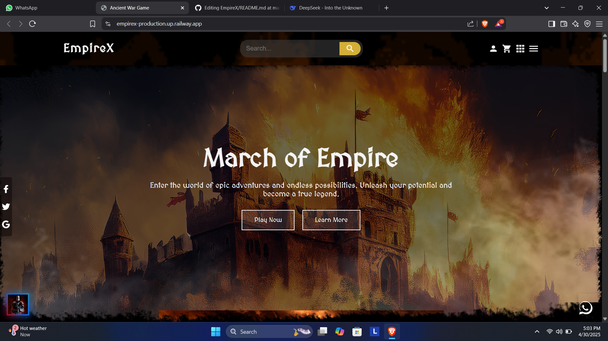
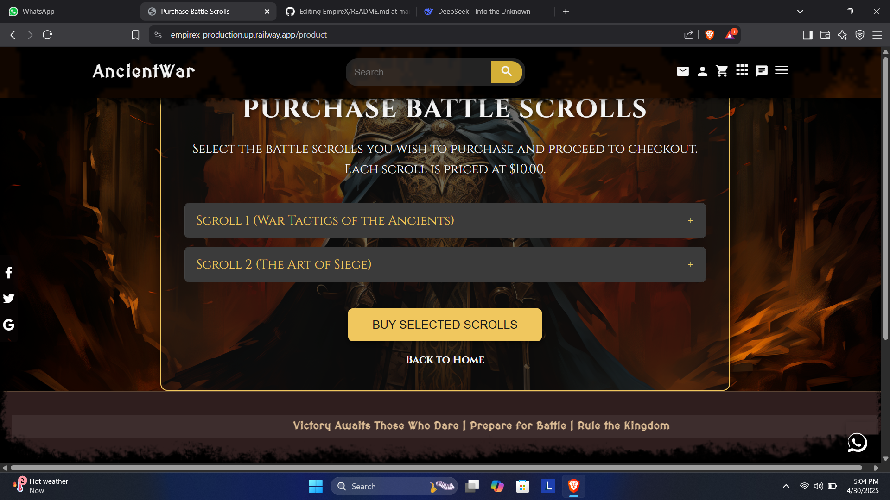
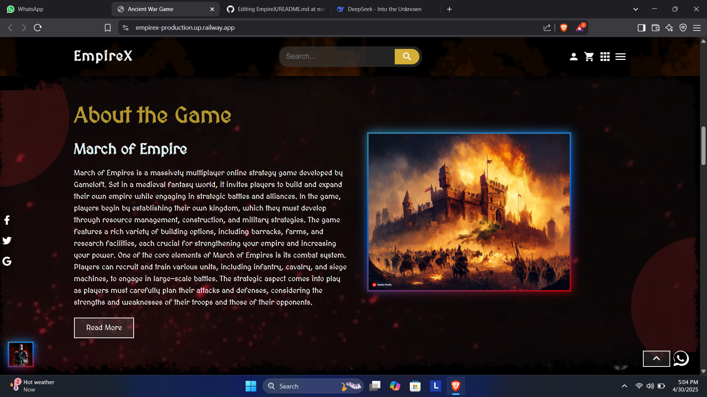
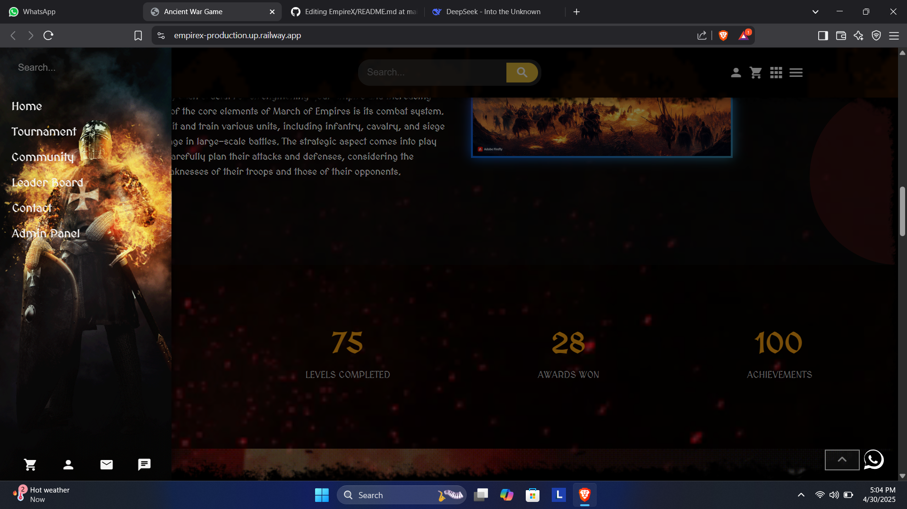

# 🏰 EmpireX - March of Empires 

 <!-- Replace with your actual banner image -->

> **A Medieval Fantasy MMO Strategy Game**  
> Build your empire, forge alliances, and conquer the realm in this immersive multiplayer experience!

  

🌐 Live Demo
Experience the game at:
https://empirex-production.up.railway.app/

## ✨ Features

  
| Feature | Description |
|---------|-------------|
| 🏗️ **Empire Building** | Construct and upgrade various buildings to strengthen your kingdom |
| ⚔️ **Strategic Warfare** | Command diverse units in tactical battles with formations |
| 🤝 **Alliance System** | Form powerful alliances and dominate the realm together |
| 👑 **Faction Selection** | Choose from unique factions with special bonuses |
| 🏆 **Tournaments** | Compete in seasonal events for glory and rewards |
| 💬 **Real-time Chat** | Coordinate with allies using Flask-SocketIO |
| 🔐 **Secure Authentication** | Flask-Login and Bcrypt for secure user accounts |

## 🖼️ Screenshots

  
  
  

## 🛠️ Tech Stack

### Backend
- **Framework**: Flask 3.0.2
- **Database**: PostgreSQL with Flask-SQLAlchemy 3.1.1
- **Authentication**: Flask-Login 0.6.3 + Flask-Bcrypt
- **Real-time**: Flask-SocketIO 5.3.6
- **Payments**: PayPal REST SDK 1.13.1
- **Email**: Flask-Mail 0.9.1
- **Environment**: python-dotenv 1.0.1

### Frontend
- HTML5, CSS3, JavaScript
- Responsive Design
- Interactive UI Elements

### Deployment
- **Platform**: Railway
- **WSGI Server**: Gunicorn 21.2.0
- **Async**: eventlet 0.33.3

## 🚀 Installation

pie
    title Game Achievements
    "Happy Players" : 150
    "Levels Completed" : 75
    "Awards Won" : 28
    "Achievements" : 100

gantt
    title Development Timeline
    dateFormat  YYYY-MM-DD
    section Core Features
    Authentication       :done,    auth1, 2024-01-01, 14d
    Empire Building      :done,    emp1, after auth1, 21d
    Combat System        :done,    comb1, after emp1, 28d
    section Multiplayer
    Alliance System      :active,  all1, 2024-02-20, 21d
    World Map            :         wmap1, after all1, 30d
    Tournaments          :         tour1, after wmap1, 14d

#  EmpireX - March of Empires 

 <!-- Replace with your animated banner -->

> "**Victory Awaits Those Who Dare**" - Prepare for the ultimate medieval strategy experience!

  

## 🌟 Featured Gameplay

  

## 🏆 Key Features

<h3 align="center"> Empire Building</h3>
<ul>
<li>🏰 Construct 15+ unique buildings</li>
<li>🌾 Manage resources and economy</li>
<li>🔬 Research technologies</li>
<li>⚒️ Upgrade your stronghold</li>
</ul>

<h3 align="center"> Warfare System</h3>
<ul>
<li>⚔️ 5 unit classes with rock-paper-scissors mechanics</li>
<li>🛡️ Formation-based combat</li>
<li>🔥 Special abilities and spells</li>
<li>🏹 Siege warfare mechanics</li>
</ul>

<h3 align="center"> Multiplayer</h3>
<ul>
<li>🤝 Alliance system with 50+ members capacity</li>
<li>🌍 Persistent world map</li>
<li>🏆 Weekly tournaments</li>
<li>💬 Real-time chat with SocketIO</li>
</ul>

## 🖼️ Screenshot Gallery

  
| Dashboard | Battle Screen | Alliance View |
|-----------|---------------|---------------|
|  |  |  |
|  **Player Dashboard** |  **Battle Interface** |  **Alliance Management** |

## ⚙️ Technical Architecture

Technology Stack

Layer	Technology
Frontend	 HTML5  CSS3  JavaScript
Backend	 Python  Flask
Database	 PostgreSQL
DevOps	 Railway  Docker

🚀 Getting Started
Prerequisites
Python 3.10+

PostgreSQL 13+

Redis (for caching)
graph TD
    A[Client] -->|HTTP/WebSocket| B[Flask Server]
    B --> C[PostgreSQL]
    B --> D[Redis Cache]
    C --> E[Player Data]
    C --> F[Game State]
    D --> G[Session Cache]
    D --> H[Leaderboards]
    B --> I[Payment Processing]
    I --> J[PayPal API]

# Clone the repository
git clone https://github.com/yourusername/EmpireX.git
cd EmpireX

# Create a virtual environment
python -m venv venv
source venv/bin/activate  # On Windows use `venv\Scripts\activate`

# Install dependencies
pip install -r requirements.txt

# Set up environment variables
cp .env.example .env
# Edit .env with your credentials

# Initialize database
flask db upgrade

# Run the application
flask run

